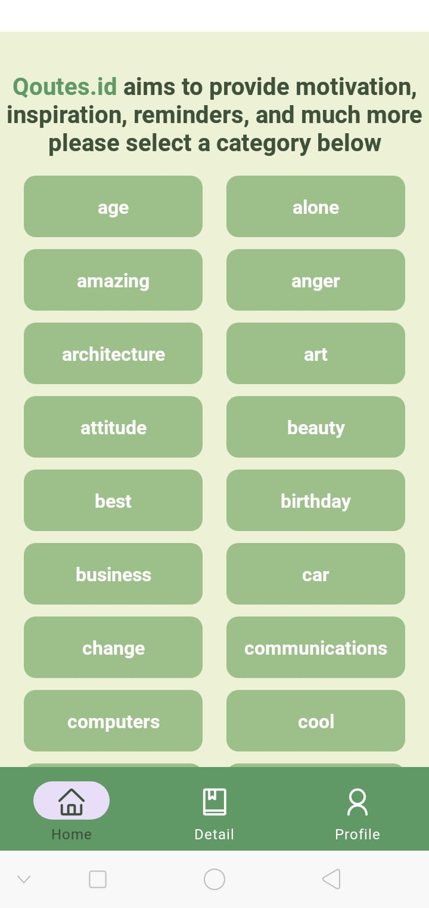
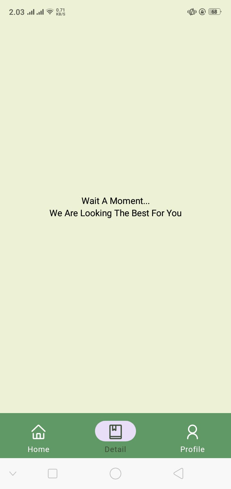
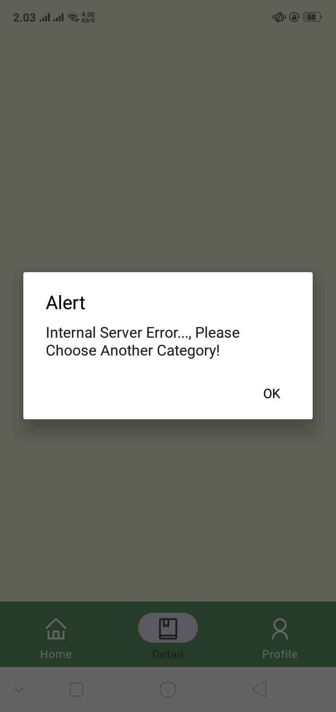
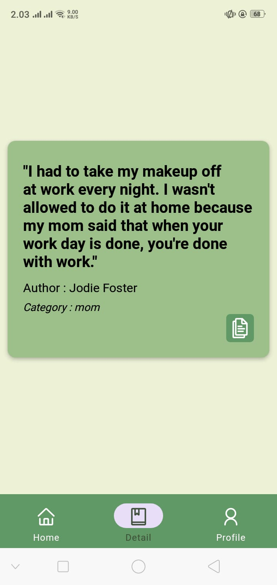
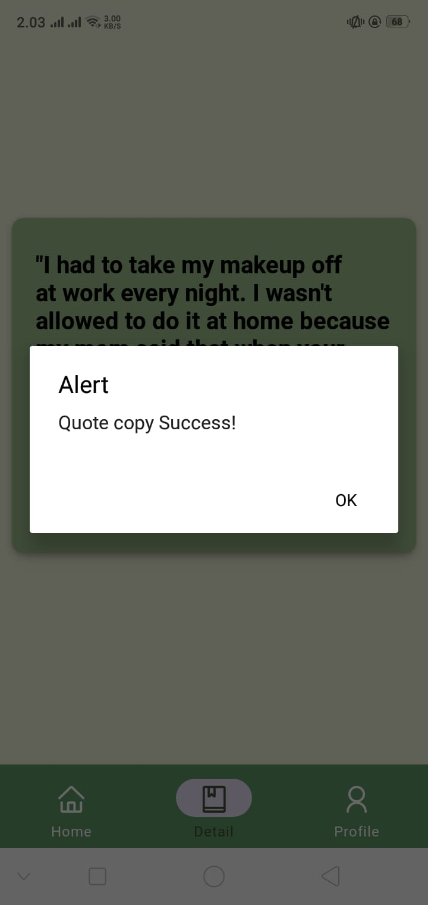
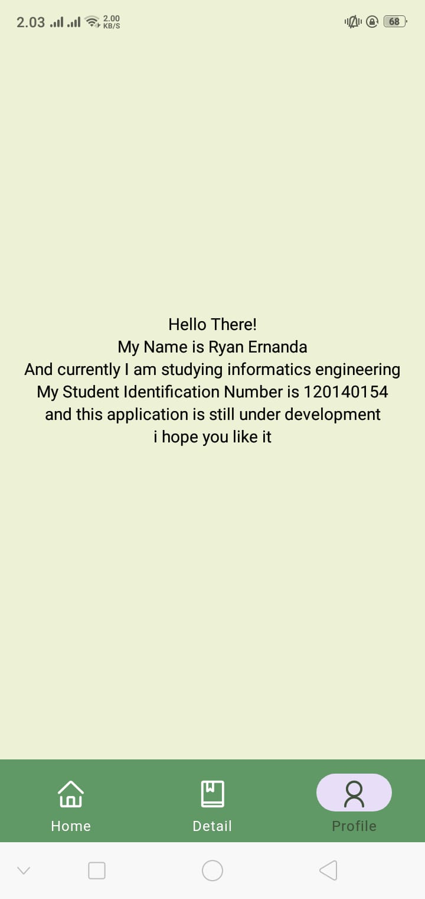

# Qoutes.Id
Download <a href="https://expo.dev/artifacts/eas/vZeqJBqAn8FzyJCZvjzsJA.apk">Qoutes.id</a>
<br/>Ryan Ernanda - 120140154

## Screenshoots
<details>
<summary>Splash Screen</summary>


</details>

<details>
<summary>Home Screen</summary>



</details>

<details>
<summary>Tampilan Mengambil Data</summary>



</details>

<details>
<summary>Jika Server Sedang Error</summary>



</details>

<details>
<summary>Jika Data Berhasil Didapatkan</summary>



</details>

<details>
<summary>API Expo Copy Clipboard</summary>



</details>

<details>
<summary>Profile Screen</summary>



</details>

## Depedencies 
- React Native
- Expo
- Expo API Clipboard
- React Native Vector Icons
- React Navigation
- Redux
- Api Ninjas

## Sturktur Repository
```
/                   # Folder Root
├─ assets/          # Semua data gambar dan file fonts
│  └─ fonts/
│    └─ MondayFeelings.ttf
│    └─ NOTE FROM AUTHOR !.txt
│  └─ Server-error.jpg
│  └─ Wait-for-get.jpg
│  └─ button-copy.jpg
│  └─ favicon.png
│  └─ get-qoutes.jpg
│  └─ icon.png
│  └─ profile-menu.jpg
│  └─ splash-screen.jpg
│  └─ splash.png
├─ components/             
│  └─ tabs.js       # Tab Navigation
├─ database/        
│  └─ index.js      # Database category
├─ pages/  
│  └─ detail.js     # Hasil Tampilan dari memilih category
│  └─ home.js       # Tampilan utama yang menamiplkan semua category
│  └─ profile.js    # Tampilan profil mahasiswa
├─ App.js           # file utama untuk merender semua file 
├─ .gitignore
├─ README.md
├─ app.json
├─ babel.config.json
├─ eas.json
├─ package-lock.json
├─ package.json
/                   # Folder Root
```

## Cara menjalankan
- Clone Repository ini
- Masuk Kedalam directory utama dan jalankan
```
npm install
```
atau
```
npm install -f
```
- tunggu hingga proses selesai
- buat account di <a href="https://api-ninjas.com/register">API NINJAS</a>.
- jika sudah coba login dan pergi ke menu <a href="https://api-ninjas.com/profile">profile</a>
- lalu pilih button `Show Api Key`
- pergi ke folder pages dan buka detail.js
- pada line 35 terdapat
```
const api = "API_KEY_HERE";
```
- ubah `API_KEY_HERE` dengan api anda.
- jika ingin di jalankan dengan android maka gunakan syntax berikut 
```
npm run android
``` 
